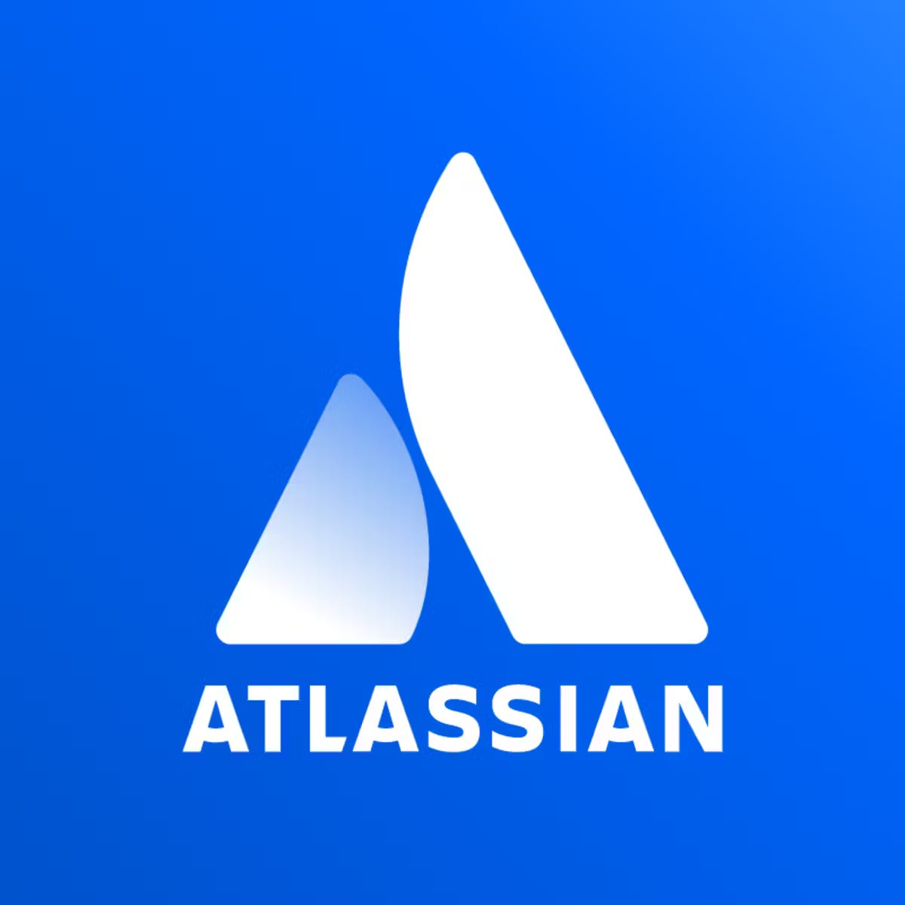

<h1 align="center">Hi 👋, I'm Prakash Kantumutchu</h1>
<h3 align="center">AI/ML Engineer | Data Scientist | LLMs & MLOps Enthusiast</h3>

<i>Turning cutting-edge AI into real-world impact with NLP, LLMs, and MLOps 🚀</i>

  
  
  
  

---

## 🧬 About Me

I’m a passionate AI/ML Engineer with a background in aerospace and academia, now focused on building intelligent, scalable, and explainable machine learning solutions.  
I specialize in **NLP**, **Generative AI**, and **MLOps** to deploy real-world AI systems that make a difference.

---

  
  

---

## ⚙️ Core Tech Stack

### 🧪 Data Science & ML Libraries

<table>
  <tr>
    <td align="center"> Python</td>
    <td align="center"> NumPy</td>
    <td align="center"> Pandas</td>
    <td align="center"> Seaborn</td>
    <td align="center"> Matplotlib</td>
    <td align="center"> Scikit-learn</td>
    <td align="center"> Keras</td>
    <td align="center"> SciPy</td>
    <td align="center"> spaCy</td>
  </tr>
  <tr>
    <td align="center"> PySpark</td>
    <td align="center"> PyTorch</td>
    <td align="center"> TensorFlow</td>
  </tr>
</table>

### 🧠 Deep Learning, MLOps & Tools

<table>
  <tr>
    <td align="center"> MLflow</td>
    <td align="center"> LangChain</td>
    <td align="center"> OpenAI</td>
    <td align="center"> Docker</td>
    <td align="center"> Git</td>
    <td align="center"> GitHub</td>
  </tr>
  <tr>
    <td align="center"> AWS</td>
    <td align="center"> Airflow</td>
    <td align="center"> DVC</td>
    <td align="center"> DAGsHub</td>
    <td align="center"> Grafana</td>
  </tr>
</table>

### ☁️ Cloud, Platforms & APIs

<table> <tr> <td align="center"> Azure</td> <td align="center"> GCP</td> <td align="center"> MS Fabric</td> <td align="center"> FastAPI</td> <td align="center"> Streamlit</td> <td align="center"> HuggingFace</td> </tr> <tr> <td align="center"> MySQL</td> <td align="center"> PostgreSQL</td> <td align="center"> SHAP</td> <td align="center"> LIME</td> </tr> </table>

### 🧽 Agile & Collaboration

<table>
  <tr>
    <td align="center"> Scrum</td>
    <td align="center"> Kanban</td>
    <td align="center"> Jira</td>
  </tr>
</table>

---

## 🚀 Currently Exploring

* 🔍 Fine-tuning LLMs for summarization and retrieval-based Q&A  
* ☁️ Azure ML & scalable MLOps pipelines  
* 🧠 AI agent frameworks & multimodal foundation models  

---
## 🏅 Professional Certifications

<table>
  <tr>
    <td> <b>Microsoft</b></td>
    <td>
      - Azure AI Engineer Associate (AI‑102) 
      - Azure AI Fundamentals (AI‑900) 
      - Career Essentials in Data Analysis / Generative AI / <b>Human Skills in the Age of AI</b> 
      - AI & ML Engineering Specialization 
      - Copilot for Productivity
    </td>
  </tr>
  <tr>
    <td> <b>DataCamp</b></td>
    <td>
      - Data Scientist in Python 
      - Machine Learning Scientist in Python 
      - AI Engineer for Data Scientist
    </td>
  </tr>
  <tr>
    <td> <b>Anaconda</b></td>
    <td>Python for Data Science Professional Certificate</td>
  </tr>
  <tr>
    <td> <b>Atlassian</b></td>
    <td>Agile Project Management Professional Certificate</td>
  </tr>
  <tr>
    <td> <b>HackerRank</b></td>
    <td>SQL (Advanced), Problem Solving (Intermediate)</td>
  </tr>
  <tr>
    <td> <b>Docker</b></td>
    <td>Docker Foundations</td>
  </tr>
  <!--‑‑‑‑‑‑‑‑‑‑‑‑‑‑‑‑‑‑‑‑‑‑ NEW ENTRIES BELOW ‑‑‑‑‑‑‑‑‑‑‑‑‑‑‑‑‑‑‑‑‑‑-->
  <tr>
    <td> <b>Vanderbilt University</b></td>
    <td>AI Agent Developer Certificate</td>
  </tr>
  <tr>
    <td> <b>KNIME</b></td>
    <td>Data Science Professional Certificate</td>
  </tr>
  <tr>
    <td> <b>Wolfram Research</b></td>
    <td>Machine Learning Statistical Foundations Professional Certificate</td>
  </tr>
  <tr>
    <td> <b>LinkedIn Learning</b></td>
    <td>Building AI Products: Prototyping Essentials Professional Certificate</td>
  </tr>
</table>

---

© 2025 Prakash Kantumutchu

