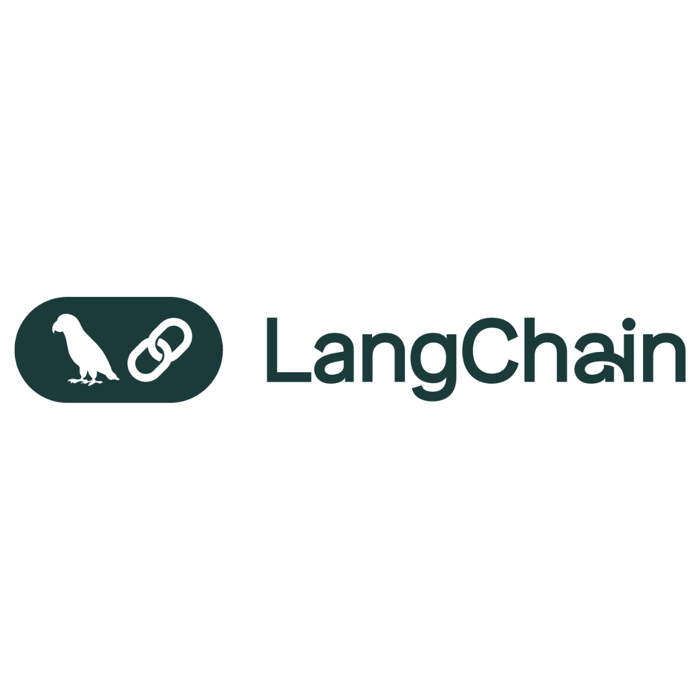
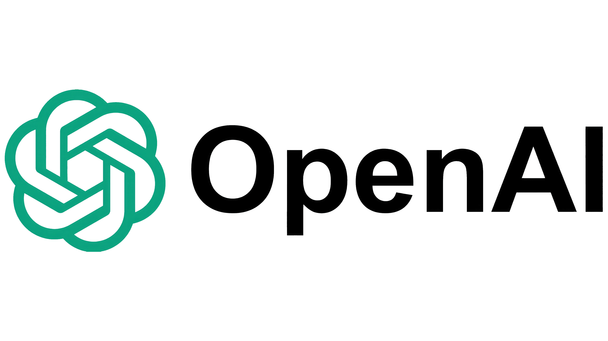

<h1 align="center">Hi 👋, I'm Prakash Kantumutchu</h1>
<h3 align="center">AI/ML Engineer | Data Scientist | LLMs & MLOps Enthusiast</h3>

<i>Turning cutting-edge AI into real-world impact with NLP, LLMs, and MLOps 🚀</i>

  
  
  
  

---

## 🧬 About Me

I’m a passionate AI/ML Engineer with a background in aerospace and academia, now focused on building intelligent, scalable, and explainable machine learning solutions.
I specialize in **NLP**, **Generative AI**, and **MLOps** to deploy real-world AI systems that make a difference.

---

## 📊 Profile Snapshot

  
  
  

---

## ⚙️ Core Tech Stack

### 🧪 Data Science & ML Libraries

<table>
  <tr>
    <td align="center"> Python</td>
    <td align="center"> NumPy</td>
    <td align="center"> Pandas</td>
    <td align="center"> Seaborn</td>
    <td align="center"> Matplotlib</td>
    <td align="center"> Scikit-learn</td>
    <td align="center"> Keras</td>
  </tr>
</table>

### 🧠 Deep Learning, MLOps & Tools

<table>
  <tr>
    <td align="center"> MLflow</td>
    <td align="center"> LangChain</td>
    <td align="center"> OpenAI</td>
    <td align="center"> Copilot</td>
    <td align="center"> Docker</td>
    <td align="center"> Git</td>
    <td align="center"> GitHub</td>
  </tr>
</table>

### ☁️ Cloud, Platforms & APIs

<table>
  <tr>
    <td align="center"> Azure</td>
    <td align="center"> GCP</td>
    <td align="center"> MS Fabric</td>
    <td align="center"> FastAPI</td>
    <td align="center"> Streamlit</td>
    <td align="center"> HuggingFace</td>
  </tr>
</table>

### 🧽 Agile & Collaboration

<table>
  <tr>
    <td align="center"> Scrum</td>
    <td align="center"> Jira</td>
    <td align="center"> Kanban</td>
  </tr>
</table>

---

## 🚀 Currently Exploring

* 🔍 Fine-tuning LLMs for summarization and retrieval-based Q\&A
* ☁️ Azure ML & scalable MLOps pipelines
* 🧠 AI agent frameworks & multimodal foundation models

---

## 🏅 Certifications

<table>
  <tr>
    <td> <b>Microsoft</b></td>
    <td>
      - Azure AI Engineer Associate (AI-102) 
      - Azure AI Fundamentals (AI-900) 
      - Career Essentials in Data Analysis / Generative AI / Human Skills 
      - AI & ML Engineering Specialization 
      - Copilot for Productivity
    </td>
  </tr>
  <tr>
    <td> <b>DataCamp</b></td>
    <td>
      - Data Scientist with Python 
      - Machine Learning Scientist / AI Engineer
    </td>
  </tr>
  <tr>
    <td> <b>Anaconda</b></td>
    <td>Python for Data Science Professional Certificate</td>
  </tr>
  <tr>
    <td> <b>Atlassian</b></td>
    <td>Agile Project Management Professional Certificate</td>
  </tr>
  <tr>
    <td> <b>HackerRank</b></td>
    <td>SQL (Advanced), Problem Solving (Intermediate)</td>
  </tr>
  <tr>
    <td> <b>Docker</b></td>
    <td>Docker Foundations</td>
  </tr>
  <tr>
    <td> <b>GitHub</b></td>
    <td>GitHub Professional Certificate</td>
  </tr>
  <tr>
    <td> <b>Python Institute</b></td>
    <td>Python Professional (OpenEDG)</td>
  </tr>
  <tr>
    <td> <b>Wolfram</b></td>
    <td>Machine Learning Statistical Foundations</td>
  </tr>
  <tr>
    <td> <b>Vanderbilt University</b></td>
    <td>AI Agent Developer (Coursera)</td>
  </tr>
</table>

---

## 🤝 Let’s Connect

I'm always open to collaborating on AI product development, research projects, and cool ideas that push boundaries.
📩 Reach out via [LinkedIn](https://www.linkedin.com/in/prakash-kantumutchu/) or [Email](mailto:k.prakashofficial@gmail.com)

---

  
  

---

🌟 *Thanks for visiting my GitHub! Follow to stay updated on my work in AI, NLP, and beyond.*
